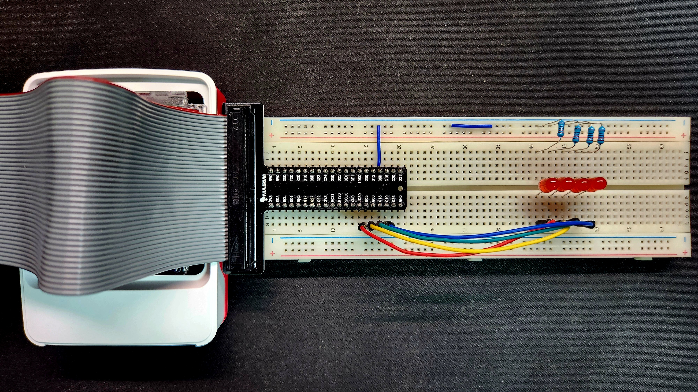
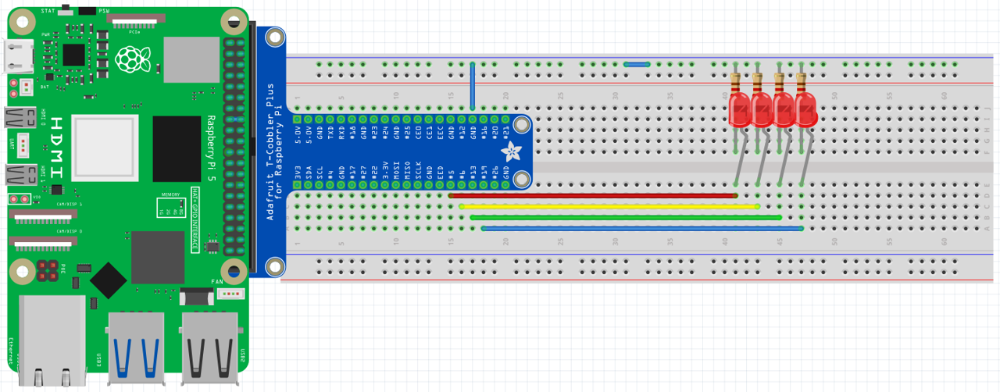

# 임베디드 통신시스템 프로젝트 - 핀컨트롤(1) domino4

이 프로젝트는 Raspberry Pi 5와 `pinctrl`을 활용하여 쉘 스크립트 내에서 GPIO를 제어하는 것을 목표로 합니다.  
본 문서에서는 전체 코드의 로직과 하드웨어 연결 구성에 대해 기술합니다.  
특히 **domio4**는 4개의 GPIO 핀을 사용하여 LED들이 순차적으로 켜졌다가 꺼지는 동작을 구현하는 프로젝트입니다.

---
## 시연 영상
실제 작동하는 모습을 아래 영상을 통해 확인할 수 있습니다:

[](https://youtu.be/9MFR2cRm7uk)

### 핀맵과 GPIO에 대한 추가 설명입니다.
[](https://youtu.be/bRw7eX6XiOk)

---

## 동작 원리 상세 설명

본 프로젝트의 핵심 동작은 **순차 토글**입니다.  
즉, 지정된 4개의 GPIO 핀에 연결된 LED들이 배열 순서대로 하나씩 HIGH로 전환되고,  
1초간 유지된 후 LOW로 복귀하는 과정을 반복합니다.

- **순차 토글 동작:**  
  - **1단계:** 배열에 정의된 첫 번째 핀(GPIO 5)이 HIGH로 설정되어 LED 1이 점등됩니다.  
    1초 대기 후 LOW로 복귀합니다.
  - **2단계:** 두 번째 핀(GPIO 6)이 HIGH로 설정되어 LED 2가 점등됩니다.  
    1초 대기 후 LOW로 복귀합니다.
  - **3단계:** 세 번째 핀(GPIO 13)이 HIGH로 설정되어 LED 3이 점등됩니다.  
    1초 대기 후 LOW로 복귀합니다.
  - **4단계:** 네 번째 핀(GPIO 19)이 HIGH로 설정되어 LED 4가 점등됩니다.  
    1초 대기 후 LOW로 복귀합니다.

이 과정을 무한 루프를 통해 반복함으로써, LED들이 연속적으로 토글되어 마치 도미노가 넘어지는 듯한 시각적 효과를 구현합니다.

- **안전 종료 처리:**  
  - SIGINT (Ctrl+C) 또는 SIGTERM 시그널이 발생하면, 모든 GPIO 핀을 LOW 상태로 전환하여 안전하게 종료됩니다.

---

## 하드웨어 구성 설명

### 실제 구성 이미지


### 하드웨어 구성 도식화


### Raspberry Pi5 pinmap


### GPIO 핀 연결 표

| 핀 번호 (BCM) | 연결된 부품 | 설명                              |
|---------------|------------|-----------------------------------|
| GPIO 5        | LED 1      | 순차 토글 동작의 첫 번째 LED        |
| GPIO 6        | LED 2      | 순차 토글 동작의 두 번째 LED        |
| GPIO 13       | LED 3      | 순차 토글 동작의 세 번째 LED        |
| GPIO 19       | LED 4      | 순차 토글 동작의 네 번째 LED        |

> **핵심:**  
> 이 구성은 4개의 핀을 사용하여 LED들이 순차적으로 켜졌다 꺼지는 시퀀스를 구현합니다.  
> 각 LED는 해당 GPIO 핀의 제어에 따라 1초간 점등 후 소등되어, 도미노처럼 연속적인 효과를 나타냅니다.

---

## 코드 설명 및 로직

아래 코드는 4개의 GPIO 핀(5, 6, 13, 19)을 사용하여,  
각 핀을 순차적으로 HIGH로 전환하고 1초 대기 후 LOW로 복귀시키는 동작을 무한 루프로 수행합니다.

```bash
#!/usr/bin/env bash
# 사용할 GPIO 핀 번호를 배열에 저장합니다.
# 배열 순서대로 각 핀이 순차 토글 동작에서 사용됩니다.
pins=(5 6 13 19)

# 현재 사용자가 root 권한으로 스크립트를 실행하는지 확인합니다.
# GPIO 제어는 하드웨어 레지스터에 직접 접근하기 때문에 관리자 권한이 필요합니다.
if [[ $EUID -ne 0 ]]; then
    echo "이 스크립트는 root 권한이 필요합니다. sudo로 실행하세요."
    exit 1
fi

# 'pinctrl' 명령어가 시스템에 설치되어 있는지 확인합니다.
# pinctrl 명령어는 GPIO 핀 제어를 수행하므로 반드시 설치되어 있어야 합니다.
if ! command -v pinctrl &> /dev/null; then
    echo "'pinctrl' 명령어가 설치되어 있지 않습니다."
    exit 1
fi

# 배열에 저장된 모든 GPIO 핀을 출력 모드로 설정합니다.
# 각 핀을 'pinctrl set <핀 번호> op' 명령어를 통해 출력 모드로 전환합니다.
for pin in "${pins[@]}"; do
    pinctrl set "$pin" op || { echo "GPIO $pin 설정 실패"; exit 1; }
done

# 스크립트 종료 시 호출될 cleanup 함수를 정의합니다.
# 이 함수는 모든 GPIO 핀을 LOW(dl) 상태로 초기화하여 안전하게 종료하도록 합니다.
cleanup() {
    echo "종료 중: GPIO 핀 LOW로 초기화 중..."
    for pin in "${pins[@]}"; do
        pinctrl set "$pin" dl
    done
    exit 0
}

# SIGINT (Ctrl+C) 또는 SIGTERM 시그널이 발생하면 cleanup 함수를 실행하도록 trap 명령어로 설정합니다.
trap cleanup SIGINT SIGTERM

# 순차적으로 각 GPIO 핀을 HIGH로 전환한 후 1초 대기 후 LOW로 복귀하는 함수입니다.
toggle_sequence() {
    for pin in "${pins[@]}"; do
        pinctrl set "$pin" dh  # 현재 핀을 HIGH로 설정 (LED 점등)
        sleep 1               # 1초간 대기
        pinctrl set "$pin" dl  # 현재 핀을 LOW로 설정 (LED 소등)
    done
}

# 무한 루프를 통해 toggle_sequence 함수를 계속 반복 실행합니다.
while true; do
    toggle_sequence
done
```

---
## 라이선스
이 프로젝트는 [MIT License](../LICENSE) 하에 오픈소스로 공개됩니다.