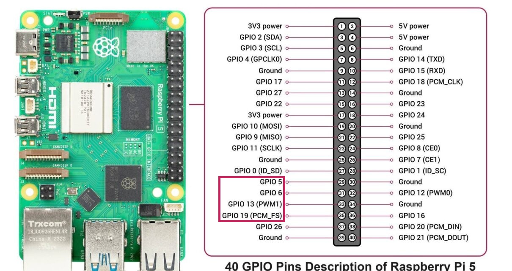

# 임베디드 통신시스템 프로젝트 - gpiozero 기반 counter8

이 프로젝트는 Raspberry Pi 5와 Python의 `gpiozero` 라이브러리를 활용하여 GPIO를 제어하는 것을 목표로 합니다.  
본 문서에서는 전체 코드의 로직, 하드웨어 연결 구성에 대해 기술합니다.  
특히 `counter8`은 LED를 활용하여 0부터 7까지의 3비트 이진수를 시각적으로 표현하는 프로젝트입니다.

---

## 시연 영상

실제 작동하는 모습을 아래 영상을 통해 확인할 수 있습니다:

[](https://youtu.be/z2csX5kX4zo)

### 핀맵과 GPIO에 대한 추가 설명입니다.
[](https://youtu.be/bRw7eX6XiOk)

---

## 동작 원리 상세 설명

- **1초 간격 카운트:**  
  메인 루프에서 0부터 7까지의 숫자를 순차적으로 출력하며,  
  각 숫자는 1초 동안 유지되고, 연결된 LED들은 해당 이진수의 각 비트에 맞춰 점등됩니다.

- **비트에 따른 LED 제어:**  
  - GPIO 5: LSB (최하위 비트)  
  - GPIO 6: 중간 비트  
  - GPIO 13: MSB (최상위 비트)

- **변환 과정:**  
  Python 코드의 `set_pin_states()` 함수는 전달된 숫자 값을 이진수로 변환하여  
  각 비트를 해당 GPIO 핀에 매핑합니다.  
  예: 숫자 5 → 이진수 `101` → GPIO 5: ON, GPIO 6: OFF, GPIO 13: ON

- **종료 처리:**  
  `SIGINT` 또는 `SIGTERM` 시그널이 감지되면 `cleanup()` 함수가 호출되어  
  모든 LED를 안전하게 소등하고 프로그램을 종료합니다.

---

## 하드웨어 구성 설명

### 실제 구성 이미지


### 하드웨어 구성 도식화


### Raspberry Pi5 pinmap


### GPIO 핀 연결 표

| 핀 번호 (BCM) | 연결된 부품 | 설명                    |
|---------------|------------|-------------------------|
| GPIO 5        | LED 1      | 최하위 비트 (LSB)       |
| GPIO 6        | LED 2      | 중간 비트               |
| GPIO 13       | LED 3      | 최상위 비트 (MSB)       |

> **핵심:**  
> 이 구성은 3개의 핀으로 0부터 7까지의 3비트 이진수 값을 출력하는 데 사용됩니다.  
> 각 LED는 대응하는 비트의 상태에 따라 켜지거나 꺼지며, 이를 통해 디지털 카운터의 역할을 수행합니다.

---

## 코드 설명 및 로직

다음은 Python `gpiozero` 기반의 전체 코드입니다:

```python
#!/usr/bin/env python3
# 시스템 PATH에서 python3 인터프리터를 탐색하여 실행합니다.
# 다양한 플랫폼에서 호환성을 보장하기 위한 권장 방식입니다.

from gpiozero import LED
# gpiozero는 Raspberry Pi 전용 고수준 GPIO 제어 라이브러리입니다.
# LED 클래스는 출력 핀을 제어하기 위한 객체로, on()/off() 메서드를 제공합니다.

from signal import signal, SIGINT, SIGTERM
# signal 모듈은 시스템 종료, Ctrl+C 같은 시그널을 감지하여 사용자 정의 함수를 실행할 수 있도록 합니다.
# SIGINT: 키보드 인터럽트 (Ctrl+C), SIGTERM: 시스템 종료 요청 (예: kill 명령)

from time import sleep
# sleep 함수는 프로그램 실행을 지정된 시간(초)만큼 지연시킵니다.

import sys
# sys.exit()를 사용하여 프로그램을 명시적으로 종료합니다.

# ----------------------------------------------------------
# 1. 사용하고자 하는 GPIO 핀 리스트 정의 (BCM 번호 기준)
# ----------------------------------------------------------
gpio_pins = [5, 6, 13]  # LSB부터 MSB 순서

# ----------------------------------------------------------
# 2. 각 핀에 대응되는 LED 객체 생성
# ----------------------------------------------------------
leds = [LED(pin) for pin in gpio_pins]

# ----------------------------------------------------------
# 3. 종료 시 실행될 함수 정의 (안전 종료 처리)
# ----------------------------------------------------------
def cleanup(signum, frame):
    """
    프로그램 종료 시 모든 LED를 소등하고 종료합니다.
    시스템 안정성과 회로 보호를 위한 필수 절차입니다.
    """
    print("\n종료 중: GPIO 핀 LOW로 초기화 중...")
    for led in leds:
        led.off()
    sys.exit(0)

# ----------------------------------------------------------
# 4. 시그널 핸들러 등록 (Ctrl+C 또는 시스템 종료 요청 감지)
# ----------------------------------------------------------
signal(SIGINT, cleanup)
signal(SIGTERM, cleanup)

# ----------------------------------------------------------
# 5. 이진 카운터 비트 출력 함수 정의
# ----------------------------------------------------------
def set_pin_states(value):
    """
    0~7 값을 이진수로 해석하여 각 비트를 대응하는 GPIO 핀에 출력합니다.
    비트가 1이면 LED ON, 0이면 OFF.
    예: 5 → 101 → GPIO5,13: ON / GPIO6: OFF
    """
    for i, led in enumerate(leds):
        if (value >> i) & 1:
            led.on()
        else:
            led.off()

# ----------------------------------------------------------
# 6. 메인 루프 (3비트 카운터 동작)
# ----------------------------------------------------------
try:
    while True:
        for i in range(8):
            set_pin_states(i)
            sleep(1)

except KeyboardInterrupt:
    cleanup(None, None)
```

---

## 라이선스

이 프로젝트는 [MIT License](../LICENSE) 하에 오픈소스로 공개됩니다.
