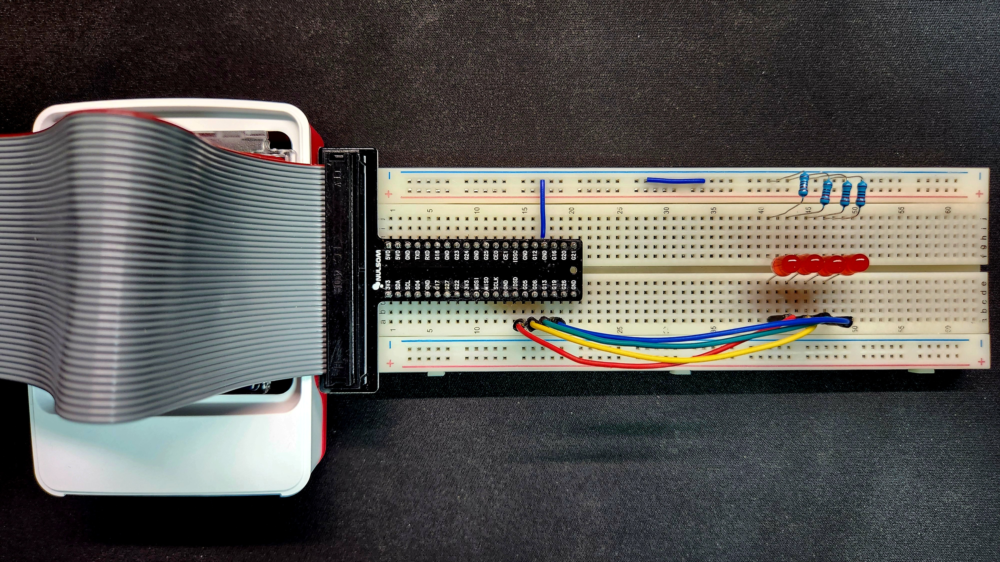
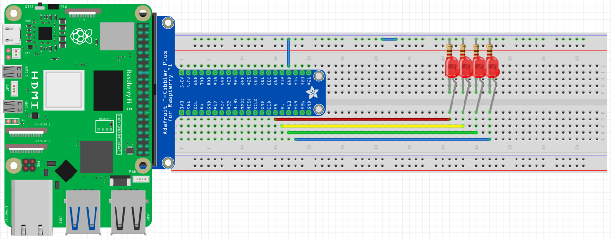

# 임베디드 통신시스템 프로젝트 - gpiozero 기반 domino4

이 프로젝트는 Raspberry Pi 5와 Python의 `gpiozero` 라이브러리를 활용하여 GPIO를 제어하는 것을 목표로 합니다.  
본 문서에서는 전체 코드의 로직과 하드웨어 연결 구성에 대해 기술합니다.  
특히 **domino4**는 4개의 GPIO 핀을 사용하여 LED들이 순차적으로 켜졌다가 꺼지는 동작을 구현하는 프로젝트입니다.

---

## 시연 영상

실제 작동하는 모습을 아래 영상을 통해 확인할 수 있습니다:

[](https://youtu.be/9MFR2cRm7uk)

### 핀맵과 GPIO에 대한 추가 설명입니다.
[](https://youtu.be/bRw7eX6XiOk)

---

## 동작 원리 상세 설명

본 프로젝트의 핵심 동작은 **순차 토글**입니다.  
지정된 4개의 GPIO 핀에 연결된 LED들이 배열 순서대로 하나씩 점등되며,  
1초간 유지된 후 소등되는 과정을 무한히 반복합니다.

- **순차 토글 동작:**  
  - **1단계:** 배열의 첫 번째 핀(GPIO 5)이 HIGH → LED 1 점등 → 1초 후 소등  
  - **2단계:** 두 번째 핀(GPIO 6)이 HIGH → LED 2 점등 → 1초 후 소등  
  - **3단계:** 세 번째 핀(GPIO 13)이 HIGH → LED 3 점등 → 1초 후 소등  
  - **4단계:** 네 번째 핀(GPIO 19)이 HIGH → LED 4 점등 → 1초 후 소등

- **안전 종료 처리:**  
  - SIGINT (Ctrl+C) 또는 SIGTERM 시그널이 발생하면, `cleanup()` 함수가 실행되어 모든 GPIO 핀을 LOW로 전환하고 안전하게 종료됩니다.

---

## 하드웨어 구성 설명

### 실제 구성 이미지


### 하드웨어 구성 도식화


### Raspberry Pi5 pinmap


### GPIO 핀 연결 표

| 핀 번호 (BCM) | 연결된 부품 | 설명                              |
|---------------|------------|-----------------------------------|
| GPIO 5        | LED 1      | 순차 토글 동작의 첫 번째 LED        |
| GPIO 6        | LED 2      | 순차 토글 동작의 두 번째 LED        |
| GPIO 13       | LED 3      | 순차 토글 동작의 세 번째 LED        |
| GPIO 19       | LED 4      | 순차 토글 동작의 네 번째 LED        |

> **핵심:**  
> 이 구성은 4개의 핀을 사용하여 LED들이 순차적으로 켜졌다 꺼지는 시퀀스를 구현합니다.  
> 각 LED는 해당 GPIO 핀의 제어에 따라 1초간 점등 후 소등되어, 도미노처럼 연속적인 효과를 나타냅니다.

---

## 코드 설명 및 로직

아래 코드는 Python의 `gpiozero` 라이브러리를 사용하여  
4개의 GPIO 핀(5, 6, 13, 19)에 연결된 LED를 순차적으로 점등하고 소등하는 기능을 구현합니다.

```python
#!/usr/bin/env python3
# 시스템 PATH에서 python3 인터프리터를 탐색하여 실행합니다.
# 다양한 플랫폼에서 호환성을 보장하기 위한 권장 방식입니다.

from gpiozero import LED
# gpiozero는 Raspberry Pi 전용 고수준 GPIO 제어 라이브러리입니다.
# LED 클래스는 출력 핀을 제어하기 위한 객체로, on()/off() 메서드를 제공합니다.

from signal import signal, SIGINT, SIGTERM
# signal 모듈은 시스템 종료, Ctrl+C 같은 시그널을 감지하여 사용자 정의 함수를 실행할 수 있도록 합니다.
# SIGINT: 키보드 인터럽트 (Ctrl+C), SIGTERM: 시스템 종료 요청 (예: kill 명령)

from time import sleep
# sleep 함수는 프로그램 실행을 지정된 시간(초)만큼 지연시킵니다.

import sys
# sys.exit()를 사용하여 프로그램을 명시적으로 종료합니다.

# ----------------------------------------------------------
# 1. 사용하고자 하는 GPIO 핀 리스트 정의 (BCM 번호 기준)
# ----------------------------------------------------------
gpio_pins = [5, 6, 13, 19]  # 순차 점등 순서

# ----------------------------------------------------------
# 2. 각 핀에 대응되는 LED 객체 생성
# ----------------------------------------------------------
leds = [LED(pin) for pin in gpio_pins]

# ----------------------------------------------------------
# 3. 종료 시 실행될 함수 정의 (안전 종료 처리)
# ----------------------------------------------------------
def cleanup(signum, frame):
    """
    프로그램 종료 시 모든 LED를 소등하고 종료합니다.
    시스템 안정성과 회로 보호를 위한 필수 절차입니다.
    """
    print("\n종료 중: GPIO 핀 LOW로 초기화 중...")
    for led in leds:
        led.off()
    sys.exit(0)

# ----------------------------------------------------------
# 4. 시그널 핸들러 등록 (Ctrl+C 또는 시스템 종료 요청 감지)
# ----------------------------------------------------------
signal(SIGINT, cleanup)
signal(SIGTERM, cleanup)

# ----------------------------------------------------------
# 5. 순차적으로 LED 점등/소등하는 함수 정의
# ----------------------------------------------------------
def toggle_sequence():
    """
    LED들을 배열 순서대로 하나씩 점등하고, 1초 후 소등합니다.
    도미노가 넘어지듯 LED가 이어지며 켜지는 효과를 연출합니다.
    """
    for led in leds:
        led.on()
        sleep(1)
        led.off()

# ----------------------------------------------------------
# 6. 메인 루프 (무한 반복 실행)
# ----------------------------------------------------------
try:
    while True:
        toggle_sequence()

except KeyboardInterrupt:
    cleanup(None, None)

```

---

## 라이선스

이 프로젝트는 [MIT License](../LICENSE) 하에 오픈소스로 공개됩니다.
